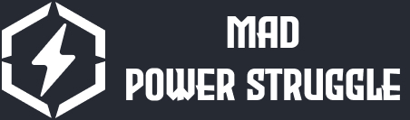

# Mad Power Struggle



Lose your sanity all over again.

Add dmx-controlled lights to your secret lair. Control the lights with cheap hardware (any respectible mad scientist keeps their world-domination budget under control).

See https://mischief-tech.com/lair-lights for full guide.

---

Manage your lights from a dashboard, similar to (but more free-er) a stream deck. Configure different fixture types, lights, and colors to your villainous liking. See also:

- Hosted browser version at https://power.mischief-tech.com
- Desktop version available in [Releases](https://github.com/camman3d/mad-power-struggle/releases)
- https://github.com/camman3d/lair-lights-dmx - Microcontroller code for the light controller

> Please note: wherever you run this app, the device must be on the same network as the controller.

## Running Locally

```
npm install
npm run dev
```

Then open a browser to `http://localhost:4200`

## Building Desktop Application

```
npm run build-make
npm run make
```

When finished, the resulting binary will be under `out/make/...` (path varies by platform).
